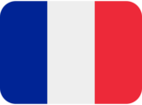

### Hi there 👋

I'm Emile, a French  full-stack & blockchain developer and software engineer.

### My main projects

- [OpenSubs](https://github.com/LesFreresMoutarde/opensubs) - An NFT marketplace that enables peer to peer rental of subscriptions to online service platforms thanks to the ERC4907 standard (project for [Alyra](https://alyra.fr/) certification) - *Solidity, React, Typescript, Firebase*
- [live.24hisere.fr](https://github.com/EmileCalixte/live.24hisere.fr) - A web application for live tracking of runners' rankings and performances during a 24-hour race - *React, Typescript, Slim PHP, MariaDB*
- [leQuiz.io](https://github.com/LesFreresMoutarde/LeQuiz.io) - A real time multiplayer quiz platform - *React, Node.js, socket.io, PostgreSQL*

### Side projects

- [Discord SubBot](https://github.com/EmileCalixte/discord-subbot) - A discord bot designed for [BUG-MAN-FR's Discord server](https://discord.com/invite/bugmanfr) to facilitate early access to videos for subscribers - *Typescript, discord.js, Node.JS*
- [Mee6 Leaderboard Extractor](https://github.com/EmileCalixte/mee6-leaderboard-extractor) - *Node.JS*

### Miscellaneous contributions

[OpenIV French translation](https://github.com/OpenIV-Team/OpenIV-Languages)

...and so many other tests, experiments and archives that you can find on my profile.

### How to reach me

 [in/emile-calixte](https://www.linkedin.com/in/emile-calixte/)  
 [Mimile#0038](https://discord.com/users/281869790363254784)  
📧 [calixte.emile@gmail.com](mailto:calixte.emile@gmail.com)  

<!--
**EmileCalixte/EmileCalixte** is a ✨ _special_ ✨ repository because its `README.md` (this file) appears on your GitHub profile.

Here are some ideas to get you started:

- 🔭 I’m currently working on ...
- 🌱 I’m currently learning ...
- 👯 I’m looking to collaborate on ...
- 🤔 I’m looking for help with ...
- 💬 Ask me about ...
- 📫 How to reach me: ...
- 😄 Pronouns: ...
- ⚡ Fun fact: ...
-->
